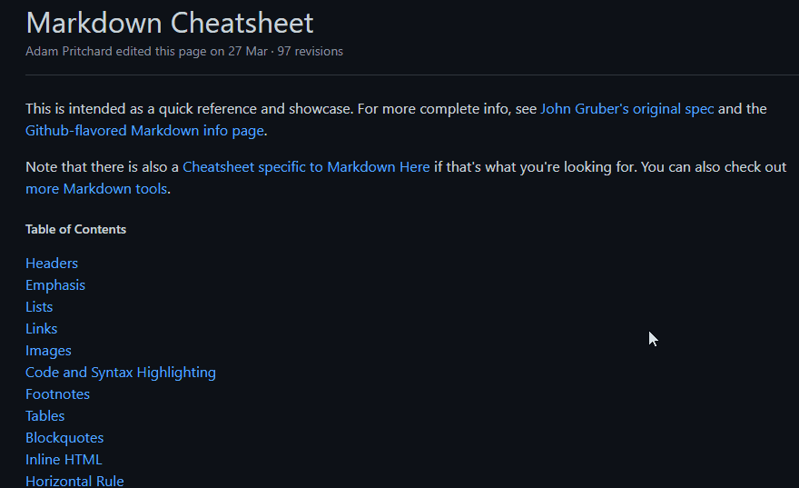

# Meu primeiro README
🐱‍💻 Apenas um primeiro teste de criação de README 🐱‍🏍

[](https://github.com/adam-p/markdown-here/wiki/Markdown-Cheatsheet)

## Algumas tecnologias utilizadas
- HTML
- CSS 
- JS


## Como utilizar
1 - Clone do projeto
````
git clone <url>
````
2- Acesse a pasta do projeto
````
cd repositorio-com-readme
````

